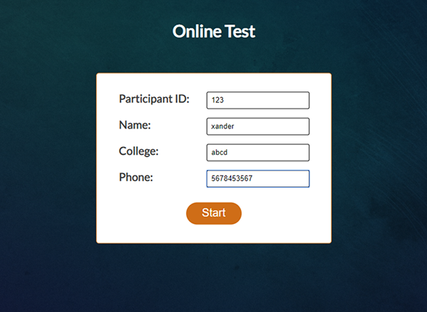
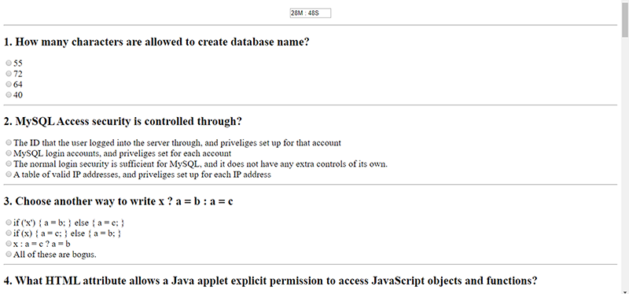
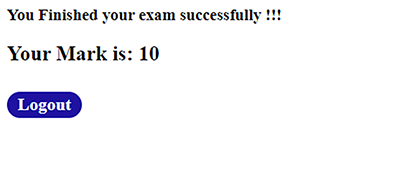

# Online-Test-System
Online Test (Quiz) system using Java- JSP, Servlets, JDBC 

# Prerequisites
* JAVA IDE(Netbeans) https://netbeans.apache.org/download/index.html
* MySql https://dev.mysql.com/downloads/mysql/
* MySql connector driver https://dev.mysql.com/downloads/connector/j/
* Apache tomcat server https://tomcat.apache.org/download-90.cgi

# How to run

1. Copy all the files in new folder named 'OnlineTest'
3. Import the folder in Netbeans
2. Add tomcat server in IDE
3. Run the given SQL file in Mysql
4. Add SQL Connecter jar file in IDE library
5. Connect to the database 'quizdb' in IDE
6. Build and run the project 

# Screenshots

## Index page

## Questions Page

## Result Page

